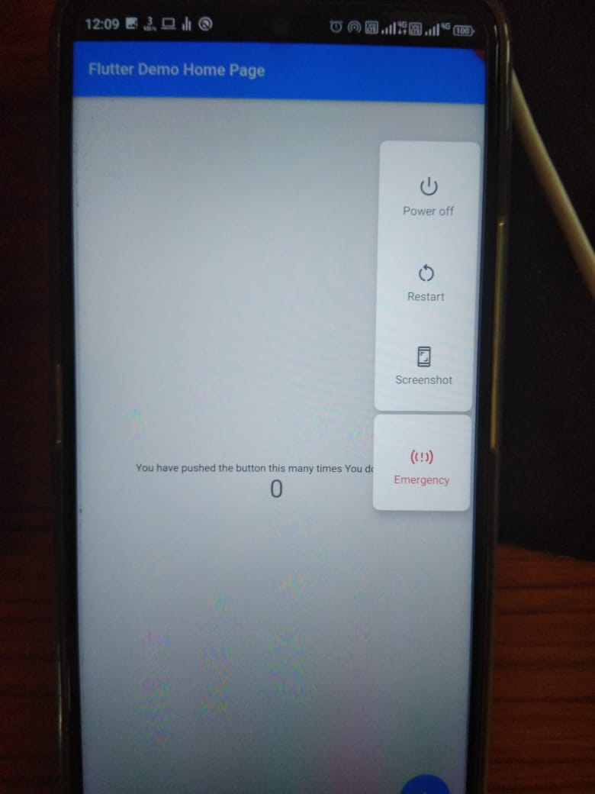
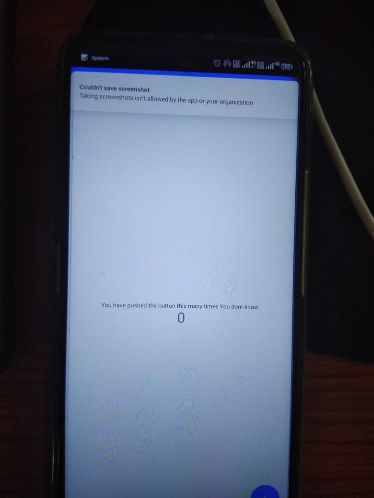

 <p align="center">
  
  
</p>


<h1 align="center">Welcome to Prevent Screenshot Flutter-App 👋</h1>
<p>
  
  <a href="to be added" target="_blank">
    
  </a>
  <a href="nonee" target="_blank">
    
  </a>
  </p>

  > A simple addition in the MainActivity.kt prevents user taking the screenshots.
 ## Code : 
 ```sh
import io.flutter.embedding.android.FlutterActivity 
import android.view.WindowManager.LayoutParams 
import io.flutter.embedding.engine.FlutterEngine

class MainActivity: FlutterActivity() 
{
    override fun configureFlutterEngine(flutterEngine: FlutterEngine) 
    { 
        window.addFlags(LayoutParams.FLAG_SECURE) 
        super.configureFlutterEngine(flutterEngine) 
    } 
}  
```

  ## APP PREVIEW


<p align="center">
  
  
 
</p>

  ## Install

```sh
flutter pub get
```

## Usage

```sh
flutter run
```

## Run tests

```sh
f5 / debug
```


## Author

👤 **Akshat Sachan**

* Website: sachan.netlify.com
* Twitter: [SachanAK36](https://twitter.com/sachanaks36)
* Github: [CryptocoderAS](https://github.com/CryptocoderAS)
* LinkedIn: [Akshat Sachan](https://www.linkedin.com/in/akshat-sachan-58b2921ab/)

## Show your support

Give a ⭐️ if this project helped you!

## 📝 License

Copyright © 2021 [Akshat Sachan](https://github.com/CryptocoderAS).<br />
This project is [Open Source](none) licensed.
